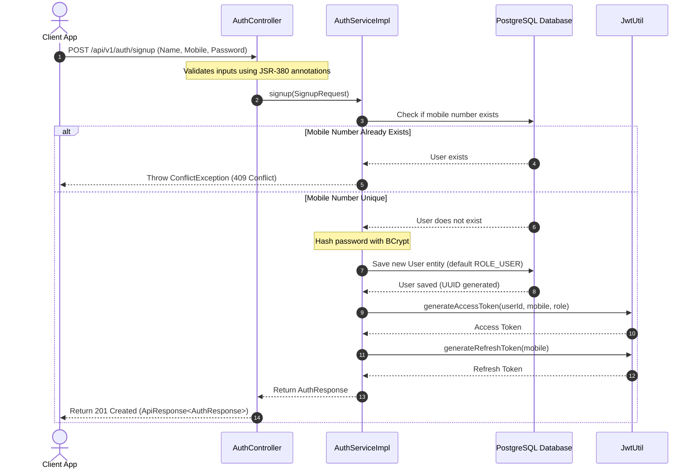
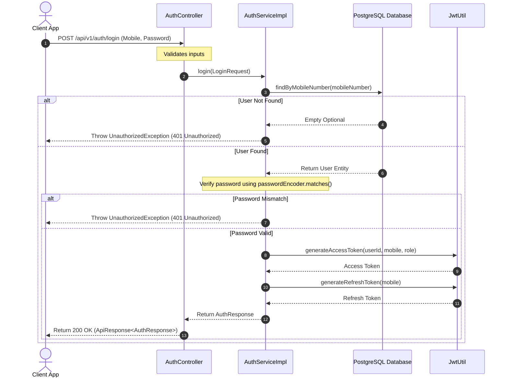

# Authentication Flow

This document details the step-by-step lifecycle of user registration and session initiation in the Loyalty Tier System.

---

## 1. User Registration (Signup) Flow

The signup flow allows a new customer to register on the platform. By default, self-registered users are assigned the `USER` role.

### Signup Endpoint
*   **Method/Path:** `POST /api/v1/auth/signup`
*   **Public Access:** Yes
*   **Response Status:** `201 Created`

---

## 2. Session Initiation (Login) Flow

Users authenticate by providing their registered mobile number and password.

### Login Endpoint
*   **Method/Path:** `POST /api/v1/auth/login`
*   **Public Access:** Yes
*   **Response Status:** `200 OK`
