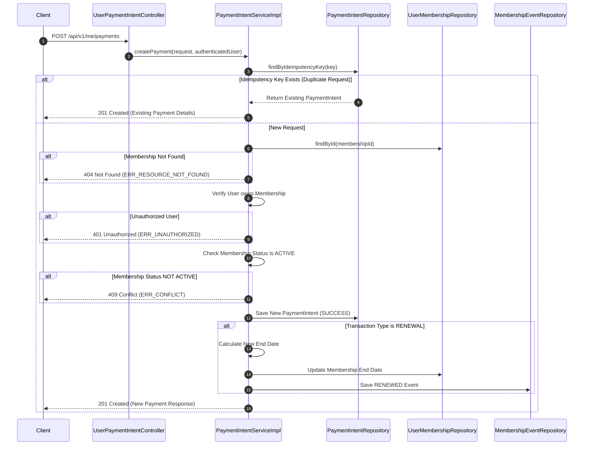
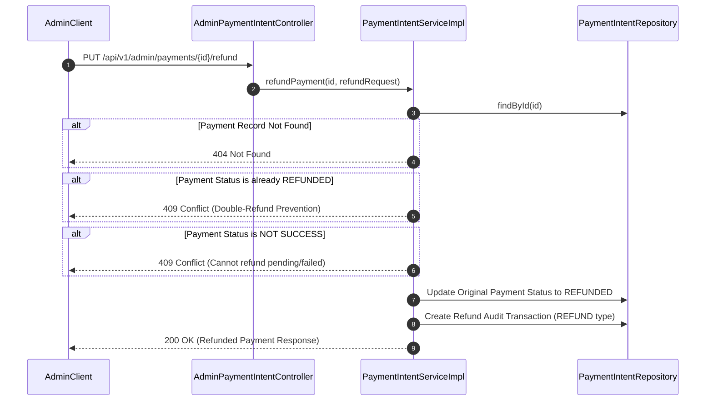

# Payment Flow

This document details the payment processing architecture, idempotency checks, membership state updates, and refund workflows within the Loyalty Tier System.

---

## 1. Create Payment Flow

The client invokes the create payment endpoint to pay for a new subscription or renew an existing one.

### Workflow Diagram

### Idempotency Strategy
To prevent double charging in the event of client retries or network errors, all payment creations require an `idempotencyKey`.
- Before processing, the database is queried for the key.
- If a match is found, the system immediately returns the existing payment intent without validating status or modifying any records.
- If no match is found, the database records the unique key along with the transaction details.

### Active Membership Rule
Payments are only accepted for active memberships. If a membership status is cancelled, expired, or pending, any payment attempt will be rejected with a `409 Conflict` status.

### Renewal Processing
When a payment of transaction type `RENEWAL` is successfully processed:
- The system reads the duration and duration unit of the membership's plan.
- The membership's current end date is extended by the plan's duration (e.g., +1 month or +1 year).
- A `RENEWED` event is saved in the membership transition log.

---

## 2. Refund Flow

Administrative users can initiate manual refunds for successful payment transactions.

### Workflow Diagram

### Double-Refund Prevention
- The service verifies that the status of the target payment intent is exactly `SUCCESS`.
- If the status is already `REFUNDED`, the request is immediately rejected with a `409 Conflict` exception ("Payment is already refunded").

### Double-Entry Audit Logs
For tracking and auditing, a refund creates two operations in the database:
1. The original payment intent is updated to `REFUNDED`.
2. A new separate transaction record of type `REFUND` is written with a negative impact (amount matching original, prefix `ref_` on transaction ID and idempotency key). This maintains complete audit logs without modifying historical data.
