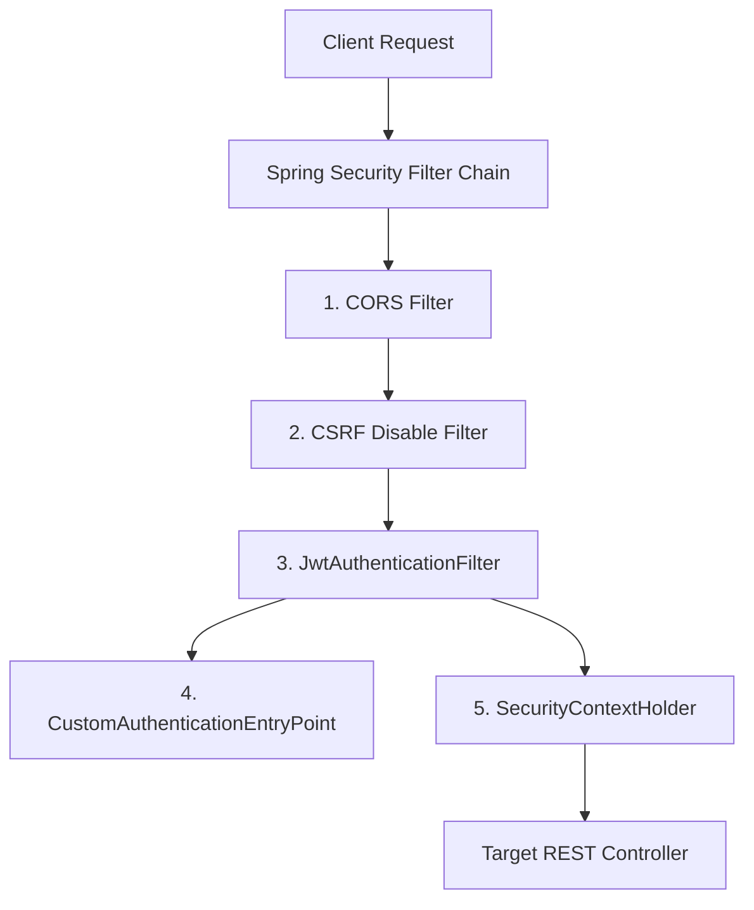

# Security Architecture

This document describes the Spring Security 6 architecture, session policy, filter pipeline, and cryptographic configurations implemented in the Loyalty Tier System.

---

## 1. Architectural Overview

The Loyalty Tier System backend implements a fully stateless, token-based security architecture. It does not create or maintain HTTP sessions (`HttpSession`) on the server. Instead, it relies on JWT (JSON Web Tokens) sent by the client inside the `Authorization` header to authenticate each request.

---

## 2. Security Filter Chain Configuration

The filter chain is defined in [SecurityConfig.java](file:///Users/dsp/development/firstclub/loyalty-tier-system/src/main/java/com/devinder/loyalty/config/SecurityConfig.java) using the modern Spring Security 6 lambda DSL.

### Endpoint Permissions

*   **Public Endpoints:**
    *   `/api/v1/auth/signup` - User registration.
    *   `/api/v1/auth/login` - User login/token generation.
    *   `/swagger-ui/**`, `/v3/api-docs/**` - OpenAPI API Documentation.
*   **Protected Endpoints:**
    *   All other routes (e.g., membership configuration, benefits, tier transactions) require a valid Access Token and suitable roles.

---

## 3. Custom Filters and Entry Points

### JwtAuthenticationFilter
*   **Location:** [JwtAuthenticationFilter.java](file:///Users/dsp/development/firstclub/loyalty-tier-system/src/main/java/com/devinder/loyalty/filter/JwtAuthenticationFilter.java)
*   **Execution:** Executed once per HTTP request (`OncePerRequestFilter`).
*   **Behavior:**
    1.  Inspects the `Authorization` header for a `Bearer ` prefix.
    2.  Extracts the token and verifies it using `JwtUtil`.
    3.  If valid, retrieves user details, wraps them in a `UsernamePasswordAuthenticationToken`, and stores the authentication object inside Spring's thread-local `SecurityContextHolder`.
    4.  If expired or invalid, registers specific request attributes indicating the failure type.

### CustomAuthenticationEntryPoint
*   **Location:** [CustomAuthenticationEntryPoint.java](file:///Users/dsp/development/firstclub/loyalty-tier-system/src/main/java/com/devinder/loyalty/filter/CustomAuthenticationEntryPoint.java)
*   **Behavior:** Triggered automatically when an unauthenticated request attempts to hit a protected resource. Writes a unified JSON error payload using the standard [ApiResponse](file:///Users/dsp/development/firstclub/loyalty-tier-system/src/main/java/com/devinder/loyalty/dto/ApiResponse.java) wrapper with an HTTP `401 Unauthorized` status and error code `ERR_UNAUTHORIZED`.

---

## 4. Cryptography and Password Encoding

To ensure production-grade security, passwords are never stored in plaintext:

*   **Encoder:** `BCryptPasswordEncoder` bean configured in [AppConfig.java](file:///Users/dsp/development/firstclub/loyalty-tier-system/src/main/java/com/devinder/loyalty/config/AppConfig.java).
*   **Salt Generation:** BCrypt automatically generates and embeds a secure random salt within the hashed output.
*   **Flow:** On signup, the password is encoded prior to saving. On login, the plain request password and stored database hash are matched using `passwordEncoder.matches()`.

---

## 5. User Roles and Authorization

We support three roles declared in the `UserRole` enum:

1.  `USER`: Default customer role. Can view their own membership and tier details.
2.  `ADMIN`: Store / program manager. Can configure tiers, benefits, and view metrics.
3.  `SUPER_ADMIN`: System owner. Can perform all operations including administrative tasks.

These roles are mapped in the Spring Security context with the `ROLE_` prefix. Authorization checks are enforced using:
*   Method-level security: e.g. `@PreAuthorize("hasRole('ADMIN')")` or `@PreAuthorize("hasAnyRole('ADMIN', 'SUPER_ADMIN')")`.
