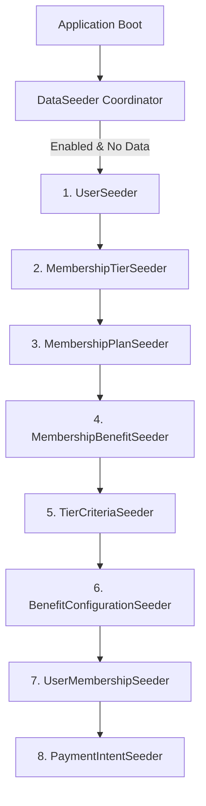

# Database Seeding Strategy

This document outlines the architecture, execution order, configuration toggles, and implementation details for the database seeding mechanism in the Loyalty Tier System.

## Architecture Overview

The database seeding system is built on Spring Boot's `CommandLineRunner` interface. It is designed to run automatically at application boot, executing only when enabled via configuration and only when no prior data exists (to prevent duplicate key or reference violations).



## Seeding Order of Operations

To prevent foreign key constraint violations, seeders are orchestrated by `DataSeeder.java` to run in the following order:

1. **UserSeeder**: Seeds standard users, admins, and super admins with secure BCrypt-hashed passwords.
2. **MembershipTierSeeder**: Seeds core tiers like `SILVER`, `GOLD`, and `PLATINUM`.
3. **MembershipPlanSeeder**: Seeds subscription plans (`Monthly`, `Quarterly`, `Yearly`).
4. **MembershipBenefitSeeder**: Seeds standard benefits like `FREE_DELIVERY`, `PRIORITY_SUPPORT`, `EARLY_ACCESS`, and `EXTRA_DISCOUNT`.
5. **TierCriteriaSeeder**: Maps the dynamic rule configurations required to qualify for each tier.
6. **BenefitConfigurationSeeder**: Maps benefit parameters (e.g. discount percentages) to specific membership tiers.
7. **UserMembershipSeeder**: Subscribes users to specific plans/tiers and seeds audit events in `MembershipEvent`.
8. **PaymentIntentSeeder**: Seeds mock transaction records for purchased memberships.

## Configuration & Environment Toggles

All seeders are environment-driven and can be turned on or off via properties in `application.properties` or environment variables in `.env`.

### Environment Variables

| Variable | Description | Default |
| :--- | :--- | :--- |
| `GLOBAL_SEED_ENABLED` | Master switch to enable or disable all seeders | `false` |
| `USER_SEED_ENABLED` | Toggle seeding of default users | `false` |
| `TIER_SEED_ENABLED` | Toggle seeding of membership tiers | `false` |
| `PLAN_SEED_ENABLED` | Toggle seeding of membership plans | `false` |
| `BENEFIT_SEED_ENABLED` | Toggle seeding of benefits | `false` |
| `TIER_CRITERIA_SEED_ENABLED` | Toggle seeding of tier criteria | `false` |
| `BENEFIT_CONFIGURATION_SEED_ENABLED`| Toggle seeding of tier benefit configurations | `false` |
| `USER_MEMBERSHIP_SEED_ENABLED` | Toggle seeding of user memberships & event logs | `false` |
| `PAYMENT_INTENT_SEED_ENABLED` | Toggle seeding of payment intents & transactions | `false` |

## Verification & Execution Logs

Seeders output clean log traces detailing their actions. If database entities already exist, the seeders gracefully skip execution to avoid duplicates:

```log
2026-05-21 21:00:00.123  INFO 12345 --- [  restartedMain] c.d.loyalty.seed.DataSeeder            : Starting global data seeding process...
2026-05-21 21:00:00.124  INFO 12345 --- [  restartedMain] c.d.loyalty.seed.UserSeeder            : User seeding started...
2026-05-21 21:00:00.250  INFO 12345 --- [  restartedMain] c.d.loyalty.seed.UserSeeder            : User seeding completed.
2026-05-21 21:00:00.251  INFO 12345 --- [  restartedMain] c.d.loyalty.seed.MembershipTierSeeder  : Membership tier seeding started...
...
2026-05-21 21:00:00.800  INFO 12345 --- [  restartedMain] c.d.loyalty.seed.DataSeeder            : Global data seeding completed successfully.
```
